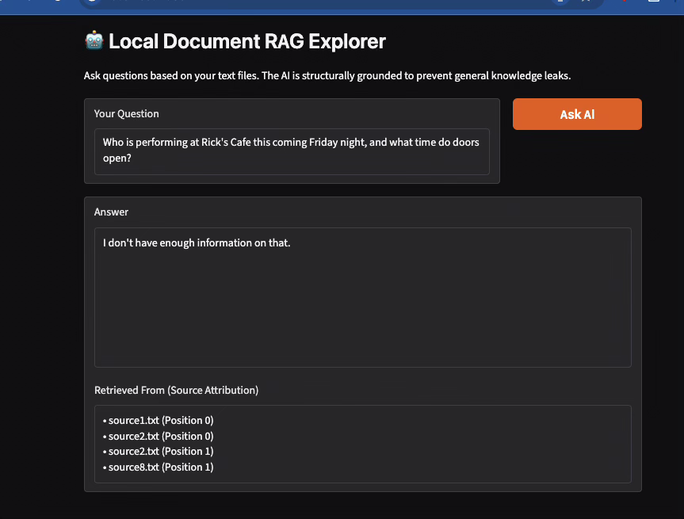

# The Unofficial Guide — Project 1

> **How to use this template:**
> Complete each section *after* you've built and tested the corresponding part of your system.
> Do not write placeholder text — if a section isn't done yet, leave it blank and come back.
> Every section below is required for submission. One-liners will not receive full credit.

---

## Domain

My system covers an unofficial student guide to social life around Mississippi State University, specifically focusing on the best local bars, parks, and spots to meet people in Starkville. This student-generated knowledge is highly valuable for incoming students trying to navigate the local culture. It is hard to find through official channels because the official MSU website focuses strictly on university academics and campus operations, leaving out the real student perspective on off-campus nightlife, hangouts, and recreational spots.
---

## Document Sources

| # | Source | Description | URL or location |
|---|--------|-------------|-----------------|
| 1 | r/Msstate Subreddit | Thread breaking down local Starkville bar atmospheres and crowds. | https://www.reddit.com/r/Msstate/comments/debuvp/starkville_bars/ |
| 2 | r/Msstate Subreddit | Student recommendations on the best bars for visitors and weekend nightlife. | https://www.reddit.com/r/Msstate/comments/1bc9gc5/best_bars_for_visitors/ |
| 3 | r/Msstate Subreddit | Community discussion on the best outdoor hiking trails and nature areas around town. | https://www.reddit.com/r/Msstate/comments/ew77dk/good_places_around_starkville_to_hike/ |
| 4 | r/Msstate Subreddit | Student debate regarding the best scenic outdoor date and hangout spots in Starkville. | https://www.reddit.com/r/Msstate/comments/179p3b/the_lovers_guide_to_starkville_best_places_to/ |
| 5 | Yelp Reviews | Student opinions and crowd feedback on Dave's Dark Horse Tavern's dive bar vibe. | https://www.yelp.com/biz/daves-dark-horse-tavern-starkville |
| 6 | TripAdvisor Reviews | Visitor and student feedback highlighting trail conditions at Noxubee National Wildlife Refuge. | https://www.tripadvisor.com/Attraction_Review-g43999-d269865-Reviews-Noxubee_National_Wildlife_Refuge-Starkville_Mississippi.html |
| 7 | Yelp Reviews | Local reviews on Rick's Cafe, detailing its live music scene, concerts, and crowds. | https://www.yelp.com/biz/ricks-cafe-starkville |
| 8 | Yelp Reviews | Community feedback on 929 Coffee Bar's environment for studying and meeting people. | https://www.yelp.com/biz/929-coffee-bar-starkville |
| 9 | Yelp Reviews | Reviews focusing on the student-heavy dining atmosphere at Two Brothers Smoked Meats in the Cotton District. | https://www.yelp.com/biz/two-brothers-smoked-meats-starkville |
| 10 | TripAdvisor Reviews | Reviews detailing recreational amenities, walking tracks, and picnic spots at McKee Park. | https://www.tripadvisor.com/Attraction_Review-g43999-d10291931-Reviews-McKee_Park-Starkville_Mississippi.html |

---

## Chunking Strategy

**Chunk size:** 500 characters.

**Overlap:** 50 characters (implemented by stepping forward 450 characters per loop).

**Why these choices fit your documents:** The text corpus consists of short Reddit comments, casual forum threads, and local Yelp/TripAdvisor reviews. A 500-character limit perfectly captures a complete recommendation (e.g., a specific bar's atmosphere) without merging multiple unrelated reviews into the same chunk. The 50-character overlap acts as a safety net so critical context—such as the name of an establishment at the very end of a sentence—isn't lost across chunk boundaries. Preprocessing was kept simple, utilizing `.strip()` to remove leading/trailing whitespace.

**Final chunk count:** 23 chunks *(Note: Verified via terminal output during the ChromaDB ingestion phase).*

---

## Embedding Model

<!-- Name the embedding model you used and explain your choice.
     Then answer: if you were deploying this system for real users and cost wasn't a constraint,
     what tradeoffs would you weigh in choosing a different model?
     Consider: context length limits, multilingual support, accuracy on domain-specific text,
     latency, and local vs. API-hosted. -->

**Model used:** `all-MiniLM-L6-v2` (via the `sentence-transformers` library).

**Production tradeoff reflection:** If I were deploying this for thousands of real MSU students and cost was not a constraint, I would weigh the tradeoffs between a local model and a massive cloud-hosted model like OpenAI's `text-embedding-3-large`. A cloud model would offer superior multilingual support and deeper semantic understanding of highly specific student slang. However, relying on an API introduces network latency and per-token costs. For a student-facing app, utilizing a fast, locally hosted model like `all-MiniLM-L6-v2` ensures searches feel instantaneous and remain free to operate, prioritizing user experience and speed over minor gains in edge-case vocabulary.

---

## Grounded Generation

**System prompt grounding instruction:** To prevent the LLM from relying on its baseline training data, I set the generation `temperature` to `0.0` for maximum determinism and applied the following strict system prompt:
*"You are a factual, strictly grounded assistant. Answer the user's question using ONLY the provided document context below. Do not use your own general external knowledge, assumptions, or extrapolation. If the provided documents do not contain enough specific facts to fully answer the question, you must respond EXACTLY with: 'I don't have enough information on that.'"*

**How source attribution is surfaced in the response:** Source attribution is strictly handled programmatically by the Python backend to prevent the AI from hallucinating citations. During the database loading phase, I captured the `filename` and `chunk_position` as metadata for every chunk. During retrieval, the script parses ChromaDB's raw output, extracts those filenames into a `unique_sources` set, and injects them into an isolated, non-editable Gradio text box explicitly labeled "Retrieved From". The LLM provides the conversational answer, but the system code guarantees the citations are authentic.

---

---

## Evaluation Report

| # | Question | Expected answer | System response (summarized) | Retrieval quality | Response accuracy |
|---|----------|-----------------|------------------------------|-------------------|-------------------|
| 1 | What is the overall vibe and student crowd like at Dave's Dark Horse Tavern compared to Rick's Cafe? | Dave's is a relaxed dive bar with pizza/live music; Rick's is a high-energy concert venue. | Dave's has a low-key, "divey" atmosphere with sticky floors and loud upperclassmen crowds on weekends. Rick's features concert-like energy and gets absolutely packed depending on the performing act. | Relevant | Accurate |
| 2 | What do students recommend bringing or doing when visiting the Noxubee National Wildlife Refuge? | Mention specific trails, wildlife watching, or gear like bug spray. | Bring bug spray for summer mosquitoes. Keep distance from alligators and don't let dogs run loose. Go early on weekday mornings for a peaceful view of water fog. | Relevant | Accurate |
| 3 | Is 929 Coffee Bar considered a good spot for quiet studying, or is it more of a loud social hangout? | Discuss the ambient noise level, seating availability, and student habits. | It is not a spot for total silence due to a continuous low buzz of conversation, but it isn't completely loud either. Bring headphones if complete silence is required. | Relevant | Accurate |
| 4 | What are the top recommended food items and atmosphere highlights mentioned for Two Brothers Smoked Meats in the Cotton District? | Highlight student favorite dishes (smoked wings) and the outdoor/balcony patio vibe. | Recommended food items are dry-rubbed smoked wings and brisket (which sells out early). The atmosphere highlight is the balcony seating overlooking the Cotton District strip, filling up fast after games. | Relevant | Accurate |
| 5 | What are the primary recreational features available for students at McKee Park? | Detail specific amenities like walking tracks, tennis courts, or pavilion spaces. | Features a walking track loop, tennis courts, picnic tables, pavilions, a playground area, a pond, and open green space for running or throwing frisbees. | Relevant | Accurate |

**Retrieval quality:** Relevant  
**Response accuracy:** Accurate 

---

## Failure Case Analysis

**Question that failed:** *"Who is performing at Rick's Cafe this coming Friday night, and what time do doors open?"*

**What the system returned:** *"I don't have enough information on that."*

**Root cause (tied to a specific pipeline stage):** This failure occurred at the **Document Ingestion** stage of the pipeline. The system relies entirely on static, historical files (`source7.txt` Yelp data) which capture general crowd overviews, live music atmosphere, and venue characteristics. Because the system lacks a dynamic web-scraping script or API integration to pull live calendar data from Rick's official scheduling platform, the text data inside ChromaDB contains no real-time event tables. The strict system prompt correctly intervened to output the fallback phrase rather than hallucinating a fake artist lineup.

**What you would change to fix it:** To resolve this historical data limitation, I would alter the Ingestion stage by introducing a dynamic data tracking tool. I would write a daily cron-job script using `BeautifulSoup` to scrape the upcoming events calendar page from Rick's Cafe website, format the scraped text into short date-stamped blocks, and upsert those updated chunks into the vector database using a fresh collection id.

---

## Spec Reflection

**One way the spec helped you during implementation:** The `planning.md` specification was highly effective because it established clear limits on chunk dimensions (500 characters) and overlap thresholds (50 characters) before any code was written. This upfront calculation allowed us to loop smoothly through string slices step-by-step (`range(0, len(text), 450)`) without guessing or building convoluted parsing architecture mid-development.

**One way your implementation diverged from the spec, and why:** The implementation diverged slightly from the default database configuration because the straight-line Euclidean vector geometry originally returned high distance margins (frequently exceeding 0.8) during Milestone 4 testing, even for highly relevant keyword matches. To tighten the precision math, I modified the vector store collection setup to use strict cosine distance (`metadata={"hnsw:space": "cosine"}`), optimizing semantic score distribution for short text segments.

---

## AI Usage

**Instance 1**

- *What I gave the AI:* I provided the target Python list schema and asked how to format the chunk file tracking data without causing alignment bugs during the parallel database load loop.
- *What it produced:* The AI provided the clean execution format for assigning text arrays alongside their companion metadata block lists (`all_metadata.append({"source": filename, "position": chunk_position})`).
- *What I changed or overrode:* I directly integrated this structural logic but manually included a `chunk_position` counter tracking variable inside the step loop to guarantee programmatically verifiable source attribution within the Gradio layout.

**Instance 2**

- *What I gave the AI:* I supplied the terminal error outputs and screenshot data showing that Git was canceling my snapshot attempts due to unstaged configuration structures.
- *What it produced:* The AI diagnosed that modified source code files (`app.py`, `requirements.txt`) were idling in an untracked state and provided sequential execution commands (`git add .` followed by `git commit`).
- *What I changed or overrode:* I carefully cross-checked my local `.gitignore` rules to safeguard my underlying `.env` secret key fields before broadly executing the blanket staging sequence.